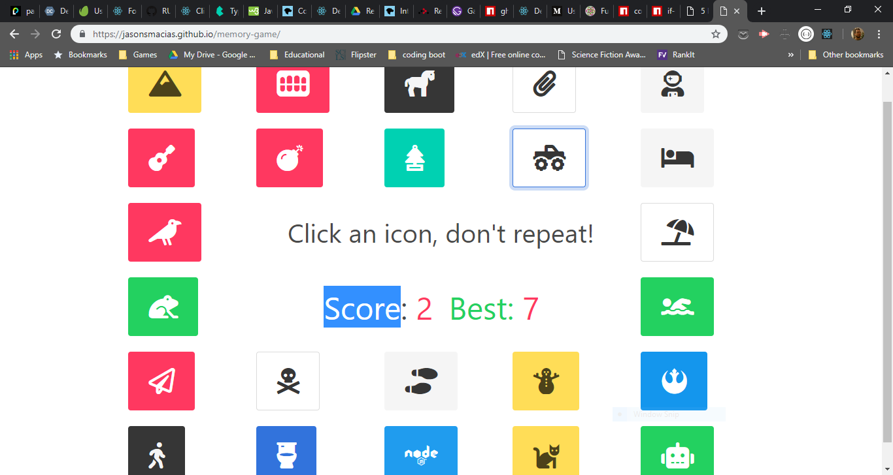

# Memory Game
## A Memory Game created with React.

## [Here is a link to the deployed site](https://jasonsmacias.github.io/memory-game/)
## https://jasonsmacias.github.io/memory-game/

This is a front-end memory game app that challenges users to remember which icons they have clicked, as their configuration and color change randomly after each attempt.  Users are notified of their current and high scores.
### Created in React with the Bulma CSS framework.

